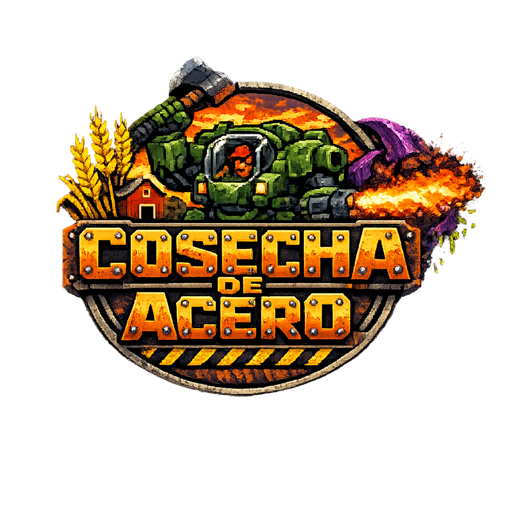

<p align="center"></p>

# 🌾🤖 Cosecha de Acero

Tower defense en pixel art: **mechas granjeros contra insectoides alienígenas**.
Inspirado en el corto *"Suits"* de Love, Death + Robots.

Los bichos salieron del agujero al oeste de la propiedad y avanzan por el
camino de tierra hacia el granero. Coloca mechas, electrifica la cerca y
sobrevive 10 oleadas — en la última llega **la Nodriza**. Elige tu
**dificultad** en el título (APRENDIZ / GRANJERO / VETERANO: más vida
para los bichos y menos créditos para ti) y, si salvas la granja, acepta
el **☠ ASEDIO SIN FIN**: oleadas procedurales cada vez más feroces, con
una Nodriza cada 5 y un **récord de la granja** que persiste entre
partidas.

¿Prefieres el caos? El modo **☠ HORDA** arranca con los bolsillos
llenos ($4000 y 12 ⚙), genera **oleadas aleatorias sin fin** desde la
primera y trae un jefe cada 4: la **NODRIZA**, la **MANTIS** (cazadora
veloz) o el **GUSANO**, un excavador blindado que **pasa por debajo de
los campos de fuerza** y pare larvas al avanzar.

La partida **se guarda sola** (localStorage) durante cada fase de
construcción: si cierras a media oleada, el botón **CONTINUAR** del
título te devuelve a la construcción previa con todo tu arsenal.

## Cómo jugar

¿Primera cosecha? El juego arranca con un **tutorial interactivo** que
te lleva de la mano (elegir mecha, plantarlo, lanzar la oleada) y se
puede saltar; el botón **TUTORIAL** del título lo repite cuando quieras.
Y al superar la oleada 9 llega un **fondo de guerra** (+$400) para
plantarle cara a la Nodriza con la granja reconstruida.

Sin instalación ni dependencias: abre `index.html` en cualquier navegador
moderno (doble clic basta). Opcionalmente, con un servidor local:

```bash
python3 -m http.server 8080
# http://localhost:8080
```

### Controles

| Tecla / acción | Efecto |
|---|---|
| `1`–`6` o clic en tarjeta | Elegir mecha para colocar |
| `7` / `8` | Generador de energía / Taller de ensamblado |
| `9` / `0` | Reclutar CARGADOR / DRON (salen del granero) |
| `M` | Enterrar una MINA ($40) en un tile del camino |
| `H` o botón ? AYUDA | Manual de campo (pausa mientras lees) |
| Clic en el pasto | Colocar el mecha o edificio |
| Clic en mecha / edificio / unidad | Seleccionar |
| Mecha seleccionado + clic en tile iluminado | **Moverlo** (paso tipo ajedrez) |
| `Esc` / clic derecho | Cancelar / deseleccionar |
| `Espacio` | Desactivar el disruptor de portales (lanza la oleada) |
| `P` o botón PAUSA | Pausa |

**En pantalla táctil** también se juega: arrastra el dedo para apuntar
(previsualiza la colocación o la diana del bombardeo) y suelta para
ejecutar; tocar otra vez la tarjeta del arsenal cancela. En móvil la
interfaz se reordena para el pulgar — mapa arriba, arsenal deslizable
pegado al mapa y el botón de oleada inmediato — con botón de
**pantalla completa ⛶**.

El **radar de oleada** (bajo el monitor táctico) anuncia qué bichos trae
la próxima oleada — con aviso de élites y de la Nodriza — y, en plena
oleada, cuántos quedan. Pasar el ratón por una tarjeta del arsenal
muestra su **ficha técnica** (daño, DPS, rango, vida, munición, paso)
antes de comprar.

### Mechas (unidades móviles con vida y munición)

- **COYOTE** ($100, 1 ⚡, paso 2) — ametralladora rápida, 200 balas.
  A **nivel 3 monta un lanzallamas**: cada disparo baña en fuego un cono
  entero de bichos.
- **CERCA-9** ($150, 1 ⚡, paso 1) — pilón tesla: salta entre bichos y los
  frena. **Dos pilones flanqueando el camino crean un campo de fuerza**
  que bloquea a los terrestres: tiene vida (80 × suma de niveles), lo
  muerden y escupen para romperlo, y se regenera en 12s si los pilones
  siguen encendidos. Los voladores pasan por encima, y ojo: los
  escupidores priorizan derribar campos a distancia.
- **BISONTE** ($180, 2 ⚡, paso 1) — cañón de área, 45 obuses.
- **VIUDA** ($260, 2 ⚡, paso 3) — francotirador, 22 balas, ×1.5 a voladores.
- **LEÑADOR** ($140, 1 ⚡, paso 2) — mecha del hacha: barre a **todos** los
  bichos a su alcance, no gasta munición y aguanta como un tractor (260 vida).
- **SEGADOR** ($240, 2 ⚡, paso 2) — hoja de energía alienígena: un solo
  tajo brutal que **atraviesa el blindaje**, sin munición.

Al seleccionar cualquier cosa, la consola muestra su **retrato** — los
mechas tienen **ilustraciones de cabina detalladas** (24×24, con el
piloto a la vista y su arma característica; lámina en
`assets/ilustraciones-mechas.png`) — y, si lleva piloto, **la cara del
granjero al estilo Doom**: se va magullando y ensangrentando conforme
el mecha (o el granero) encaja daño.

Cada disparo gasta munición; sin balas el mecha calla hasta que lo
reabastezcan — pero **todos los mechas pelean cuerpo a cuerpo**: si un
bicho se les pega, lo aplastan a golpes (sin gastar munición). Se
**mueven** como piezas de ajedrez — al seleccionarlos se iluminan las
casillas alcanzables con **flechas** — y **cambian de aspecto** al subir
de nivel: hombreras de acero a nivel 2, astas doradas a nivel 3. Mejorar
cuesta dinero **y partes ⚙** y entrega el mecha reparado y recargado.

Cada mecha viste **su propio color de chasis** (arena, azul, marrón,
carbón, verde, turquesa) para distinguirlos de un vistazo.

### Minas

La **MINA** ($40, tecla `M`, máx. 8 activas) se entierra en cualquier
tile libre del camino y revienta al primer bicho **terrestre** que la
pisa: 90 de daño en área ignorando blindaje. Los voladores ni la ven.
Barata, sucia y muy de granja.

### Unidades de apoyo

- **CARGADOR** ($90) — peón mecánico: lleva munición del granero a los
  mechas **y los repara en el campo**. Los mechas cubren su ruta:
  priorizan a los bichos que atacan a tu gente.
- **DRON** ($140) — vuela sobre cualquier tile. Alterna entre modo
  **RECARGA** (reabastece mechas) y modo **ATAQUE** (métralla ligera,
  reposicionable con un clic). **La partida empieza con uno y cada 90
  segundos llega otro gratis al granero.**

### Consola contextual y autodestrucción

Al seleccionar cualquier cosa (mecha, edificio o unidad) aparece un
**marcador ▼** sobre ella y el arsenal cede su lugar a un **menú
contextual** con sus acciones. Todas las unidades tienen un botón de
**AUTODESTRUCCIÓN ☠** (con confirmación): la onda expansiva daña a los
bichos *y a tus propios aliados* — si la explosión destruye unidades
vecinas, éstas **detonan en cadena**. Alinear generadores tiene sus
riesgos... y sus usos desesperados.

Notas de campaña: la **VIUDA** hace daño ×1.5 a voladores, y los drones
de regalo dejan de llegar cuando ya tienes 4 activos.

### Especial: BOMBARDEO ☢

Con `B` o el botón de mando ($250 + 2⚙, enfriamiento 45s) armas un
bombardeo: apunta con la diana y haz clic — tras un instante cae un obús
que **arrasa a los bichos del área** (ignora blindaje).

### Infraestructura

- **GENERADOR** ($120) — alimenta con 4 ⚡ a los mechas **dentro de su
  radio**. Un mecha lejos de todo generador queda SIN ⚡ y no dispara.
- **TALLER** ($200) — sin al menos uno en pie no se ensamblan ni mejoran
  mechas. Admite una mejora: **torreta de techo** ($150 + 1⚙) que dispara
  sola a los bichos que pasan. **Cada taller extra abarata las mejoras un
  12% (máximo 36%)** y todo taller **produce $2 cada 6 segundos** — la
  economía de escala de la granja.
- **GRANERO** — trae una **torreta de serie** en el techo desde el
  arranque. Haz clic en él para **reforzarlo** (2 niveles): cada
  refuerzo da vidas extra (+5, +8) y monta una torreta adicional más
  potente que la anterior.

¿Dudas en plena partida? El botón **? INSTRUCCIONES [H]** abre el manual
de campo (y pausa el juego mientras lees).

Los bichos **muerden y escupen** a todo: mechas, unidades y edificios.
Repara, reconstruye y reposiciona.

### Disruptor de portales

Entre oleadas el disruptor contiene el portal **30 segundos**; al agotarse,
la oleada arranca sola. Desactivarlo antes con `Espacio` da un bono de
**+$2 por segundo restante**.

### Bichos

Drones (enjambre), avispas (**voladoras: van directo al granero, sin seguir
el camino**), escupidores (**atacan a distancia**), escarabajos blindados,
**Detonadores** (kamikazes que cargan contra tu defensa y se inmolan — su
onda daña a tus unidades y puede desatar tu propia explosión en cadena;
matarlos de cerca también los detona) y la **NODRIZA**, que engendra
drones y escupe. Desde la oleada 4 aparecen
**variantes de élite** (aura roja): más grandes, con el doble de vida y
botín; abundan más a cada oleada. Los bichos duros y las élites sueltan
**partes ⚙** al morir, y cada oleada superada deja **+1 ⚙ de chatarra**
garantizada.

Ojo justo: si un **Detonador** remata a una unidad dañada, ésta estalla
con onda **reducida** y la cadena no se propaga más allá — las
explosiones en cadena a plena potencia son solo tuyas.

## Tecnología

HTML5 Canvas + JavaScript vanilla, cero dependencias. Pixel art definido como
matrices de caracteres (`js/sprites.js`), tiles procedurales con RNG con
semilla, y efectos de sonido sintetizados con WebAudio (`js/audio.js`).

Arquitectura modular sin build: cada archivo es un IIFE y los módulos se
comunican por el espacio compartido `window.G`, en orden de carga:

```
index.html        layout, HUD, consola de mando, overlays
js/sprites.js     paleta + sprites + tiles
js/data.js        balance: torres, enemigos, oleadas, edificios, mapa
js/audio.js       sintetizador de efectos
js/core.js        estado, camino, energía, campos, helpers compartidos (G)
js/anim.js        motor de tweens + efectos (despliegue, anillos, cadáveres)
js/behaviors.js   comportamientos de enemigos y armas (tablas componibles)
js/entities.js    motor: colocación, oleadas, daño, unidades, update()
js/render.js      fondo pre-horneado + dibujado del frame
js/ui.js          HUD, consola contextual e input
js/main.js        bucle principal
```

Para añadir un enemigo o arma nueva: define sus datos en `data.js` y, si
necesita lógica propia, una entrada en las tablas de `behaviors.js`
(`ENEMY_BEHAVIORS` / `WEAPONS`) — el motor no se toca.

El diseño completo está en [PLAN.md](PLAN.md).
